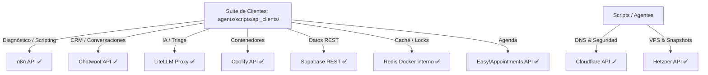

# 📡 DentalA - Registro Central de APIs (URLs Listas para Usar)

Este documento contiene las **URLs de API completamente construidas y autenticadas** para cada servicio del proyecto DentalA. El agente puede copiar y ejecutar estos endpoints directamente sin necesidad de leer credenciales ni construir headers manualmente.

> **Fuente de credenciales**: [`.env`](file:///c:/Users/Renzo/OneDrive/Documentos/DentalA/.env) — actualizar ahí si un token cambia, luego regenerar las URLs de esta sección.

---

## ✅ Servicios Activos (APIs listas para usar)

### 1. n8n — Motor de Orquestación
**Base autenticada**: `https://n8n.dental-a.com/api/v1` + header `X-N8N-API-KEY: $DENTALA_N8N_API_KEY`

```bash
# Listar todos los workflows
curl -s "https://n8n.dental-a.com/api/v1/workflows?limit=20" \
  -H "X-N8N-API-KEY: $DENTALA_N8N_API_KEY"

# Ver ejecuciones recientes
curl -s "https://n8n.dental-a.com/api/v1/executions?limit=10" \
  -H "X-N8N-API-KEY: $DENTALA_N8N_API_KEY"
```

**En Node.js** (desde scripts):
```js
const N8N = "https://n8n.dental-a.com/api/v1";
const N8N_HEADERS = { "X-N8N-API-KEY": process.env.DENTALA_N8N_API_KEY };
// fetch(`${N8N}/workflows`, { headers: N8N_HEADERS })
```

---

### 2. Chatwoot — CRM y Mensajería
> **Nota de DNS**: El dominio configurado y activo es `chatwood.dental-a.com` (con "d", no "t"). Este es el dominio registrado oficialmente en Cloudflare para DentalA. No intente reemplazarlo por "chatwoot" ya que la ruta no existe.
**Base autenticada**: `https://chatwood.dental-a.com/api/v1/accounts/1` + query `?api_access_token=$DENTALA_CHATWOOT_TOKEN`

```bash
# ⚠️ IMPORTANTE: Chatwoot requiere el token como HEADER (no como query param)

# Listar conversaciones abiertas
curl -s "https://chatwood.dental-a.com/api/v1/accounts/1/conversations" \
  -H "api_access_token: $DENTALA_CHATWOOT_TOKEN"

# Listar agentes de la cuenta
curl -s "https://chatwood.dental-a.com/api/v1/accounts/1/agents" \
  -H "api_access_token: $DENTALA_CHATWOOT_TOKEN"

# Listar contactos (pacientes)
curl -s "https://chatwood.dental-a.com/api/v1/accounts/1/contacts" \
  -H "api_access_token: $DENTALA_CHATWOOT_TOKEN"

# Enviar mensaje a conversación {id}
# curl -s -X POST "https://chatwood.dental-a.com/api/v1/accounts/1/conversations/{id}/messages" \
#   -H "api_access_token: $DENTALA_CHATWOOT_TOKEN" \
#   -H "Content-Type: application/json" \
#   -d '{"content":"Hola, te confirmamos tu turno.","message_type":"outgoing"}'
```

**En Node.js**:
```js
const CW = "https://chatwood.dental-a.com/api/v1/accounts/1";
const CW_HEADERS = { "api_access_token": process.env.DENTALA_CHATWOOT_TOKEN };
// fetch(`${CW}/conversations`, { headers: CW_HEADERS })
```

---

### 3. Coolify — Orquestador de Infraestructura
**Base autenticada**: `http://5.78.221.158:8000/api/v1` + header `Authorization: Bearer $DENTALA_COOLIFY_TOKEN`

```bash
# Ver servidores administrados
curl -s "http://5.78.221.158:8000/api/v1/servers" \
  -H "Authorization: Bearer $DENTALA_COOLIFY_TOKEN"

# Ver todos los servicios (contenedores Docker Compose)
curl -s "http://5.78.221.158:8000/api/v1/services" \
  -H "Authorization: Bearer $DENTALA_COOLIFY_TOKEN"

# Ver variables de entorno del servicio Chatwoot
curl -s "http://5.78.221.158:8000/api/v1/services/lfyospr2p78cyth785ypiz88/envs" \
  -H "Authorization: Bearer $DENTALA_COOLIFY_TOKEN"
```

**UUIDs de servicios conocidos** (verificados vía API):
| Servicio | UUID en Coolify | Estado |
|----------|----------------|--------|
| Supabase | `qc44hzwzpa7acogjcytr4rh8` | `running:healthy` ✅ |
| Chatwoot | `lfyospr2p78cyth785ypiz88` | `running:unhealthy` ⚠️ |
| n8n + postgres + worker | `ge1bsrb7whe1u5l8t4upsv2p` | `running:healthy` ✅ |
| LiteLLM | `hxkra0ialk04smmxgoewenlu` | `running:unknown` ✅ |

> **Nota**: Easy!Appointments es el motor central de agendamiento. Toda la lógica de agendamiento usa exclusivamente `easyappointments_client.js`.

---

### 4. Supabase — Base de Datos y Auth
**Base autenticada**: `https://supabase.dental-a.com` + headers `apikey` y `Authorization`

```bash
# Listar tablas existentes
curl -s "https://supabase.dental-a.com/rest/v1/" \
  -H "apikey: $ANON_KEY" -H "Authorization: Bearer $ANON_KEY"

# Consultar tabla patients (cuando exista)
curl -s "https://supabase.dental-a.com/rest/v1/patients?select=*&limit=10" \
  -H "apikey: $ANON_KEY" -H "Authorization: Bearer $ANON_KEY"

# Ver configuración de Auth
curl -s "https://supabase.dental-a.com/auth/v1/settings" \
  -H "apikey: $ANON_KEY" -H "Authorization: Bearer $ANON_KEY"

# Listar storage buckets
curl -s "https://supabase.dental-a.com/storage/v1/bucket" \
  -H "apikey: $ANON_KEY" -H "Authorization: Bearer $ANON_KEY"
```

**En Node.js**:
```js
const SB = "https://supabase.dental-a.com";
const SB_ANON    = process.env.DENTALA_SUPABASE_ANON_KEY; // anon (cliente)
const SB_HEADERS = { "apikey": SB_ANON, "Authorization": `Bearer ${SB_ANON}` };
// fetch(`${SB}/rest/v1/patients?select=*`, { headers: SB_HEADERS })
```

**Constantes útiles:**
```
Studio UI : https://supabase-studio.dental-a.com
JWT Secret: $DENTALA_SUPABASE_JWT_SECRET
DB Host   : supabase.dental-a.com:5432  DB: postgres  User: postgres  Password: $DENTALA_DATABASE_PASSWORD
```

---

### 5. Cloudflare — DNS y Seguridad Edge
**Base autenticada**: `https://api.cloudflare.com/client/v4` + header `Authorization: Bearer $DENTALA_CLOUDFLARE_TOKEN`

```bash
# Ver todos los registros DNS del dominio dental-a.com
curl -s "https://api.cloudflare.com/client/v4/zones/$DENTALA_CLOUDFLARE_ZONE_ID/dns_records?per_page=100" \
  -H "Authorization: Bearer $DENTALA_CLOUDFLARE_TOKEN"

# Ver estado de la zona DNS
curl -s "https://api.cloudflare.com/client/v4/zones/$DENTALA_CLOUDFLARE_ZONE_ID" \
  -H "Authorization: Bearer $DENTALA_CLOUDFLARE_TOKEN"
```

**Constantes útiles:**
```
Zone ID : $DENTALA_CLOUDFLARE_ZONE_ID
Dominio : dental-a.com
```

---

### 6. Hetzner Cloud — VPS y Snapshots
**Base autenticada**: `https://api.hetzner.cloud/v1` + header `Authorization: Bearer $DENTALA_HETZNER_TOKEN`

```bash
# Ver estado del servidor VPS (5.78.221.158)
curl -s "https://api.hetzner.cloud/v1/servers" \
  -H "Authorization: Bearer $DENTALA_HETZNER_TOKEN"

# Ver reglas de firewall
curl -s "https://api.hetzner.cloud/v1/firewalls" \
  -H "Authorization: Bearer $DENTALA_HETZNER_TOKEN"

# Crear snapshot del servidor (reemplazar {id} con el ID real del servidor)
# curl -s -X POST "https://api.hetzner.cloud/v1/servers/{id}/actions/create_image" \
#   -H "Authorization: Bearer $DENTALA_HETZNER_TOKEN" \
#   -d '{"type":"snapshot","description":"backup-manual"}'
```

---

### 7. Easy!Appointments — Agenda Clínica
> **Estado**: **ACTIVO**.
> **Wrapper API**: `easyappointments_client.js`.

Las consultas y reservas se realizan directamente mediante llamadas al cliente integrado a la API de EA:

```javascript
const eaClient = require('./easyappointments_client.js');

// 1. Obtener slots libres
const slots = await eaClient.getFreeSlots(dentistId, '2026-06-08', 30);

// 2. Crear una cita
const appointment = await eaClient.createAppointment(dentistId, '+5491100000000', '2026-06-08 09:00:00', 30, 'Ortodoncia');

// 3. Cancelar una cita
await eaClient.cancelAppointment(dentistId, appointmentId);
```

---

### 8. LiteLLM — AI Gateway (Proxy de Modelos)
**Base autenticada**: `https://litellm.dental-a.com/v1` + header `Authorization: Bearer $DENTALA_LITELLM_KEY`

```bash
# Listar modelos disponibles en el proxy de LiteLLM
curl -s "https://litellm.dental-a.com/v1/models" \
  -H "Authorization: Bearer $DENTALA_LITELLM_KEY"

# Probar chat completion con gpt-4o-mini
curl -s -X POST "https://litellm.dental-a.com/v1/chat/completions" \
  -H "Authorization: Bearer $DENTALA_LITELLM_KEY" \
  -H "Content-Type: application/json" \
  -d '{
    "model": "gpt-4o-mini",
    "messages": [{"role": "user", "content": "Hola"}]
  }'
```

**En Node.js**:
```js
const LITELLM = "https://litellm.dental-a.com/v1";
const LITELLM_HEADERS = { 
  "Authorization": `Bearer ${process.env.DENTALA_LITELLM_KEY}`,
  "Content-Type": "application/json"
};
// fetch(`${LITELLM}/chat/completions`, { method: "POST", headers: LITELLM_HEADERS, body: JSON.stringify(...) })
```

**Credenciales de la UI de administración de LiteLLM**:
*   **Dashboard URL**: `https://litellm.dental-a.com`
*   **Usuario**: `$DENTALA_LITELLM_UI_USER`
*   **Contraseña**: `$DENTALA_LITELLM_UI_PASSWORD`

---

## ⏳ Servicios Pendientes de Credenciales

| **Vapi** [REMOVIDO] | `https://api.vapi.ai` | N/A | Canal descontinuado en la arquitectura lógica del Módulo 2 |

---

## 🗺️ Mapa de Integración



---

## 📋 Comandos de Diagnóstico Rápido

```bash
# Test completo de todos los servicios
node --env-file=.env .agents/scripts/api_clients/test_connections.js

# Test individual Chatwoot (requiere token en variable)
curl -s "https://chatwood.dental-a.com/api/v1/accounts/1/agents" \
  -H "api_access_token: $DENTALA_CHATWOOT_TOKEN"

# Ver registros DNS actuales (requiere token y zone ID en variables)
curl -s "https://api.cloudflare.com/client/v4/zones/$DENTALA_CLOUDFLARE_ZONE_ID/dns_records" \
  -H "Authorization: Bearer $DENTALA_CLOUDFLARE_TOKEN" | node -e "const d=require('fs').readFileSync('/dev/stdin','utf8'); const j=JSON.parse(d); j.result.filter(r=>['A','CNAME'].includes(r.type)).forEach(r=>console.log(r.type, r.name, '->', r.content))"
```
