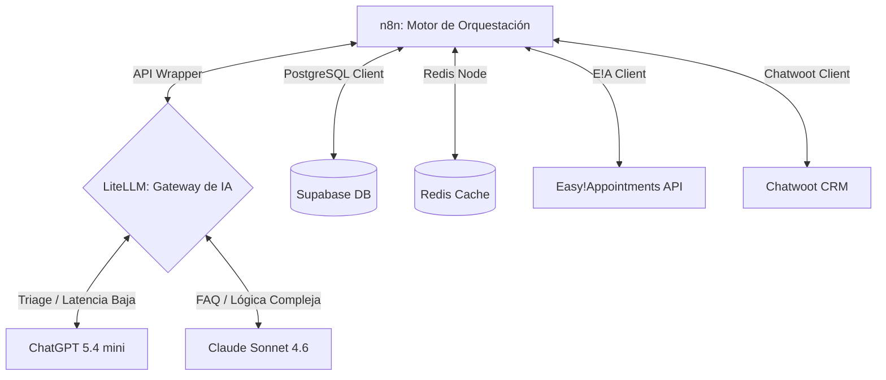

# Documento de Conectividad e Integración de IA

## Módulo 2: Conectividad, Gateway de IA y Relacionamiento (Integrations & AI Core)

**Propósito del Módulo**: Definir la infraestructura de red, la capa de wrappers y clientes API para la comunicación de servicios, la configuración de LiteLLM como orquestador estricto de modelos de lenguaje, y las directrices psicológicas y conversacionales (reglas de relacionamiento) que rigen la interacción de la IA con los pacientes de forma personalizada para un Dentista Particular.

---

## 1. Arquitectura de Conectividad e Infraestructura

El ecosistema opera autohospedado en un servidor VPS de **Hetzner** administrado por **Coolify**.

### 1.1. Seguridad Edge y Perimetral (Cloudflare & Zero Trust)
- **Cifrado en Tránsito**: Todo el tráfico entre Cloudflare y el VPS de Hetzner viaja cifrado bajo el modo **SSL/TLS Full (Strict)** de Cloudflare, empleando certificados validados.
- **Acceso Administrativo Zero Trust**: El acceso administrativo al editor de n8n, Supabase Studio y Coolify Dashboard se realiza exclusivamente mediante **Cloudflare Tunnels (Zero Trust)** restringidos con autenticación multifactor (MFA).

### 1.2. Wrappers y Clientes de API Unificados con Aislamiento SaaS
Para asegurar la consistencia y escalabilidad, el sistema emplea una suite de scripts clientes desarrollados en JavaScript (Node.js) que encapsulan la comunicación. Cada cliente requiere de forma obligatoria el paso explícito del `dentist_id` para garantizar que la operación esté aislada por inquilino:

- **supabase_client.js**:
  * `async getPatient(dentist_id, patient_id)`: Retorna el paciente. El descifrado de `clinical_notes` y `psychological_profile` se hace con la librería `crypto` en n8n de forma nativa.
  * `async updatePatient(dentist_id, patient_id, updates)`: Realiza un UPDATE. El cifrado AES se delega a n8n antes de la llamada.
  * `async getTreatmentDocuments(dentist_id, treatment_type, document_type)`: Consulta la tabla `treatment_documents` para recuperar metadatos.
  * `async createSignedUrl(dentist_id, storage_path, expires_in_seconds)`: Llama a la API de Storage para generar enlace temporal.
  * `async logAccess(user_id, dentist_id, patient_id, action_type, resource_type, ip_address)`: Inserta log de acceso clínico.
  * `async updateSessionStatus(dentist_id, patient_id, session_status)`: Cambia el estado del bot.

- **chatwoot_client.js**:
  * `async sendWhatsAppMessage(inbox_id, phone_number, content)`: Despacha un mensaje simple. (Para plantillas de Meta, se delega a un sub-workflow nativo en n8n).
  * `async createPrivateNote(conversation_id, content)`: Envía una nota interna (amarilla) visible únicamente para el doctor.
  * `async assignConversation(conversation_id, agent_id)`: Asigna el chat al agente correspondiente.

- **easyappointments_client.js** (Reemplaza a `supabase_scheduler_client.js`):
  * `async getFreeSlots(dentist_id, dateStr, durationMin)`: Consulta los intervalos libres en la instancia de Easy!Appointments del dentista.
  * `async createAppointment(dentist_id, patient_phone, start_time, durationMin, treatment_type)`: Reserva la cita utilizando la API de Easy!Appointments y mapea al paciente.
  * `async cancelAppointment(dentist_id, appointment_id)`: Cancela la cita de forma atómica en Easy!Appointments.

- **litellm_client.js**:
  * `async completeChat(task_type, messages, temperature)`: Envía un array de mensajes al endpoint unificado de LiteLLM (`/v1/chat/completions`). El parámetro `task_type` (`triage | faq | copilot | commands`) determina en el gateway la regla de enrutamiento del modelo y el caching de prompts de Anthropic.

- **redis_client.js**:
  * `async acquireLock(key, value, ttl_seconds)`: Ejecuta el comando atómico `SET key value NX EX ttl_seconds` para locks simples.
  * `async releaseLock(key, value)`: Libera la clave de forma segura.
  * `async enqueueDebounce(dentist_id, patient_id, text, expire_seconds)`: Concatena texto en una lista en Redis y restablece la expiración.

### 1.3. Cifrado Estricto de Datos de Salud (AES-256-GCM Estático)
Toda información médica, diagnósticos o apreciaciones que pudiesen comprometer la privacidad del paciente (`clinical_notes`, `psychological_profile`) se manejan mediante cifrado AES-256-GCM. 
- La clave criptográfica es estática (sin rotación) y se hospeda como variable de entorno segura dentro de n8n.
- **Ejecución Directa (MVP)**: Para simplificar la arquitectura, n8n realiza el cifrado y descifrado nativamente utilizando Nodos de Código y la librería `crypto` de Node.js, eliminando la necesidad de un endpoint externo `/crypto`.
- Para garantizar el recupero en casos de disaster recovery, el administrador de IT cuenta con copias fuera de la red de la llave maestra (ej. Bitwarden y cajas fuertes físicas).

---

## 2. Gateway de Inteligencia Artificial (LiteLLM)

El gateway de IA unifica las llamadas y proporciona conmutación estricta por error.

- **Modelos de IA Exactos y Restringidos**:
  * **ChatGPT 5.4 mini**: Utilizado para triaje rápido, clasificación inicial y evaluación de intenciones.
  * **Claude Sonnet 4.6**: Modelo utilizado para razonamiento profundo, respuesta de FAQs, validación clínica y mantener el contexto general de la conversación (empatía de Marta).
- **Políticas Estrictas de Fallback de LLM**:
  * Si **Claude Sonnet 4.6** falla (error 5xx, rate limits, timeout), LiteLLM re-enruta automáticamente la petición hacia **ChatGPT 5.4 mini**.
  * Si **ChatGPT 5.4 mini** también falla o reporta que no puede manejar la complejidad (respuesta vacía, "no sé"), el flujo de n8n interviene y dispara la regla de pausa automática: el bot responde: *"Estoy teniendo dificultades técnicas. La secretaria te responderá en breve."* y ejecuta `session_status = 'bot_paused'`, derivando el control al humano.

---

## 3. Perfil Psicológico y UX Avanzada del Agente de IA (Identidad Marta)

El bot de DentalA utiliza una inteligencia social estructurada para garantizar que las interacciones mantengan una calidad Premium y una calidez humana de consultorio de autor, encarnando la personalidad de la asistente Marta:

- **Identidad Conversacional (Marta)**:
  * **Personaje**: El bot se presenta y actúa como Marta, la asistente principal del doctor (ej: *"Hola, le escribe Marta, asistente del Dr. Pérez"*). 
  * **Edad y Carácter**: Representa a una mujer de aproximadamente 50-55 años. Es sumamente experimentada, atenta, educada, formal y con un gran instinto de cuidado clínico y empatía maternal (cariñosa).
- **Trato Formal y Respetuoso**: Por defecto, Marta se dirige al paciente tratándolo de "Usted", utilizando expresiones pulcras y cordiales (ej: *"Es un gusto saludarle"*, *"Que tenga una hermosa tarde"*, *"No se preocupe, aquí lo resolveremos"*). Mantiene siempre una línea base inquebrantable de cordialidad profesional.
- **Evolución de la Confianza y Tuteo**: Marta no es rígida ni robótica. Su tono **evoluciona dinámicamente** en base al nivel de cercanía y las respuestas del paciente:
  * *Pacientes Fríos/Formales*: Mantiene el trato de "Usted" y respuestas sumamente pulcras y concisas.
  * *Pacientes Afectuosos/Habituales*: Si el paciente responde con emojis, palabras cariñosas o demuestra familiaridad a lo largo del tiempo, Marta relaja paulatinamente la formalidad. Empieza a tutear con respeto (ej. *"¿Cómo estás, Juan? Qué alegría saludarte..."*), inyecta emojis cálidos de forma natural y utiliza expresiones afectuosas controladas (ej. *"nuestro querido paciente"*, *"estimado/a"*), logrando una calidez humana que fideliza sin perder el estatus del consultorio.
- **Espejamiento de Estructura (Mirroring)**: El bot evalúa el tamaño y estilo de redacción del paciente. Si el paciente es escueto, Marta responde con precisión y cortesía. Si el paciente es detallista o conversador, Marta se toma el tiempo de responder con calidez y amplitud.
- **Memoria Asíncrona (Contexto de Cercanía)**: Tras una conversación exitosa, la IA extrae en segundo plano pequeños detalles personales del paciente (ej. fobias al torno dental, viajes planeados, notas familiares o preferencias de tratamiento) y los almacena cifrados en el campo `psychological_profile` de la tabla `patients`. En la siguiente interacción, Marta inyecta este perfil para saludar de manera hiper-personalizada.

---

## 4. Arquitectura de Audio y Voz (Whisper de entrada vs. TTS de salida)

El canal de WhatsApp es inherentemente multimedia. Para optimizar la experiencia de usuario (UX), los tiempos de respuesta y la eficiencia de costos del SaaS multitenant, el sistema adopta una política de diseño asimétrico respecto al audio:

### 4.1. Entrada de Audio: Transcripción con Whisper (Altamente Recomendado)
* **Caso de Uso**: Tanto los pacientes que prefieren enviar notas de voz detallando sus molestias, como el dentista que dicta los comandos de voz clínicos al finalizar su consulta.
* **Implementación**: n8n recibe el archivo binario de audio de la API de Meta (`.ogg` o `.m4a`), descarga el recurso de forma temporal en un búfer local, y lo envía a la API de Whisper (vía LiteLLM) para obtener la transcripción en texto plano.
* **Justificación**: Whisper proporciona una precisión de transcripción superior al 95% para español con acentos locales y terminología dental básica, lo cual desbloquea la interacción manos libres y agiliza el trabajo del profesional.

### 4.2. Salida de Audio: Prohibición de Síntesis de Voz de IA (TTS)
* **Caso de Uso**: El bot respondiendo al paciente mediante un mensaje de voz sintético de IA (Text-to-Speech).
* **Directiva**: **Queda estrictamente prohibido generar y enviar audios generados por IA (TTS) en las respuestas automáticas del bot**. Las respuestas salientes del bot hacia el paciente deben ser estrictamente en formato de texto formateado con emojis o plantillas interactivas de WhatsApp.
* **Justificación de Ingeniería**:
  1. *Latencia Prohibitiva*: El proceso de tomar la respuesta del LLM, enviarla a una API de síntesis (como OpenAI TTS o ElevenLabs), generar el archivo de audio, subirlo a un servidor de almacenamiento y luego enviarlo a WhatsApp introduce un retardo (delay) adicional de **1.5 a 3.0 segundos**. Esto rompe la percepción de una charla fluida e instantánea.
  2. *Costos de Operación Altos*: La facturación por caracter de las APIs de TTS es significativamente superior a la de los modelos de texto, lo que reduciría drásticamente el margen de ganancias del SaaS al escalar.
  3. *Rechazo en la Experiencia de Usuario (UX)*: Los pacientes perciben con rapidez la naturaleza artificial y robótica de las voces sintetizadas de IA, lo que destruye el sentido de "calidez y cercanía" y la confianza clínica que un odontólogo de autor busca transmitir. 
  4. *Excepción*: Si el odontólogo desea enviar indicaciones específicas mediante su propia voz, el sistema permite adjuntar **archivos de audio pregrabados reales del doctor** cargados previamente en Supabase Storage, lo cual refuerza la autenticidad y el trato personalizado.

---

## 5. Mapa de Interacciones de este Módulo

Para asegurar la coherencia lógica de toda la plataforma, el Módulo 2 actúa como el **núcleo de integración y conectividad** y se relaciona de forma estrecha con el resto de los componentes del SaaS:

### 5.1. Con Módulo 1 (Base de Datos)
- **Cifrado en Reposo**: `supabase_client.js` interactúa con el backend de encriptación interna `/crypto` para descifrar `clinical_notes` e hidratar los prompts de indicaciones posoperatorias en memoria.
- **Auditoría de Accesos**: Cualquier llamada a `supabase_client.getPatient` registra automáticamente una transacción de lectura en `ACCESS_LOGS_CLINICAL` (Módulo 1 §2.4) para auditoría.

### 5.2. Con Módulo 3 (Gateway Inbound & Comandos)
- **Debounce y Cola**: `redis_client.js` provee las funciones `enqueueDebounce` y `acquireLock` que utiliza el gateway del Módulo 3 para atenuar ráfagas de mensajes del paciente antes de pasarlas a n8n.
- **Entrada de Audio**: El flujo de ingesta de notas de voz en el Módulo 3 llama a `litellm_client.js` para transcribir el dictado del doctor y las dudas de los pacientes.

### 5.3. Con Módulo 4 (FAQs y Agendamiento)
- **Consulta de Disponibilidad**: El motor de agendamiento conversacional del Módulo 4 llama a `easyappointments_client.js` (`getFreeSlots`) para procesar de manera estructurada los horarios libres del consultorio.
- **RAG Textual**: `litellm_client.js` orquesta el ruteo hacia Claude Sonnet 4.6 para estructurar las respuestas obtenidas desde la base de datos `faq_textual`.

### 5.4. Con Módulo 6 (Campañas Outbound & Copilot)
- **Briefing de Empatía (Copilot)**: n8n llama a `supabase_client.js` (`getPatient`) para descifrar en memoria el `psychological_profile` y las `clinical_notes` 10 minutos antes de la cita, permitiendo al Módulo 6 generar la nota interna en Chatwoot vía `chatwoot_client.js` (`createPrivateNote`).
- **Templates Outbound**: Cualquier recordatorio 3-3-4 o campaña disparada por el Módulo 6 invoca a `chatwoot_client.js` (`sendWhatsAppMessage`) pasando el `template_name` homologado por Meta para evitar el bloqueo del canal.

### 5.5. Con Módulo 7 (Fail-Safes y Monitoreo)
- **Circuit Breaker**: El cliente `supabase_client.js` monitorea la disponibilidad de la base de datos central de Supabase. Si detecta fallos consecutivos de red o base de datos, levanta una excepción `ERR_SUPABASE_DOWN` que alerta al Módulo 7.
