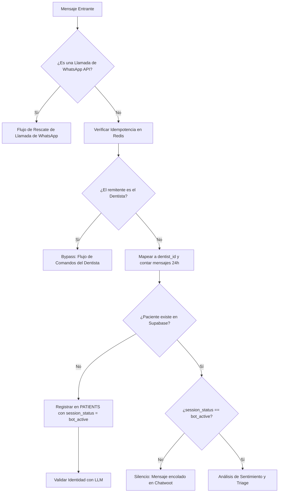

# Documento de Operación Inbound y Triage

## Módulo 3: Motor Inbound - Triaje, Multimedia y Comandos (Intake & Triage)

**Propósito del Módulo**: Definir la lógica de recepción de mensajes entrantes (webhooks), identificación y onboarding de pacientes, clasificación inicial de intenciones (triaje con LLM puro), idempotencia, control de abuso y costos, procesamiento de contenido multimedia, Recuperación de Llamadas de WhatsApp y el procesamiento de los Comandos de Voz y Texto del Dentista.

---

## 1. Triaje Inicial e Identificación (Onboarding)

Cada interacción de un paciente a través de WhatsApp o Easy!Appointments activa un webhook en n8n que dispara el proceso de identificación y direccionamiento inteligente:

### Reglas de Triaje y Onboarding:
- **Rescate de Intentos de Llamada de WhatsApp (Call Rescue)**: 
  El sistema detecta el webhook de Meta con `type = 'unsupported'` y código `131050`. Inmediatamente, envía una plantilla de rescate aprobada:
  > *"¡Hola! Veo que intentaste llamarnos por aquí. Esta línea no recibe llamadas de voz tradicionales por políticas de WhatsApp API, pero estamos totalmente activos para chatear. Si es una urgencia, responde con la palabra 'URGENCIA'. Si deseas agendar, responde con 'AGENDAR'."*
- **Triaje con LLM Puro**: La detección de intenciones se realiza **estrictamente mediante el LLM**.
- **Detección del Teléfono del Dentista**: Si el remitente coincide con el teléfono del dentista, se hace un bypass total del triaje de pacientes y se deriva al Flujo de Comandos.
- **Traducción al Vuelo**: El LLM detecta el idioma del paciente en tiempo real y responde en consecuencia.
- **Análisis de Sentimiento y Alerta de Tensión**: Si el LLM detecta un paciente enojado o con tensión crítica, n8n cambia `session_status = 'bot_paused'` y envía una alerta en Chatwoot para intervención humana rápida.
- **Fallback por Fallos Consecutivos de IA**: Si la IA (LiteLLM) falla por error o timeout **2 veces seguidas** para un paciente, n8n cambia el estado a `bot_paused` y envía el mensaje fijo: *"Hola, estoy con un problema técnico. La secretaria te responderá."*

---

## 2. Gestión de Multimedia, Anti-Spam y Límites

### 2.1. Idempotencia y Prevención de Duplicados
- **Claves Únicas**: Todos los webhooks entrantes se deduplican en Redis con un TTL de 24 horas para evitar ejecuciones fantasma.
  * *Meta (WhatsApp)*: La clave es el `message_id` del payload.
  * *Easy!Appointments*: La clave es `appointment_id + event_type + timestamp` (redondeado a 10 segundos).
Si la clave ya existe, el webhook se ignora.

### 2.2. Límite Diario de Mensajes y Costos (Sin Tablas Extra)
- **Límite de 20 mensajes**: Antes de invocar al LLM, n8n consulta la tabla `whatsapp_message_log` para contar los mensajes inbound del paciente en las últimas 24 horas.
- **Pausa Automática**: Si supera los 20 mensajes, el bot responde con un texto fijo indicando que la secretaria tomará el caso, cambia `session_status = 'bot_paused'` por 2 horas, y no invoca al LLM, controlando así los costos de tokens.

### 2.3. Detección de Abuso Delegada a IA
- **Flag de Abuso (`abuse_flag`)**: En cada llamada a Claude, se incluye un prompt oculto para evaluar si el usuario está abusando del sistema, enviando insultos recurrentes o intentando jailbreaks.
- Si Claude devuelve `abuse_flag = true`, el sistema cambia el estado a `session_status = 'blocked_manual_review'`, envía un mensaje de despedida y notifica al administrador.

### 2.4. Recepción y Procesamiento Multimedia
* **Notas de Voz del Paciente**: n8n descarga el binario `.ogg` y lo envía a Whisper. 
  * *Regla de Audios Inaudibles*: Si la transcripción resultante tiene **menos de 5 palabras** o es inaudible, n8n responde automáticamente: *"Disculpa, no te escuché bien. ¿Podrías repetirlo?"* sin continuar el triaje.
* **Imágenes Clínicas**: Se evalúan a través de un Modelo de Visión con una directiva rígida de solo describir lo que se ve sin diagnosticar, pasando luego la descripción al triaje.
* **GIFs y Stickers**: Ignorados si el bot no está esperando datos específicos; si espera datos para agendar, se responde cordialmente solicitando texto o audio.

---

## 3. Mando de Voz y Texto del Dentista (Aprobación Interactiva)

### 3.1. Dictado Clínico por Audio (Confirmación Obligatoria)
El dentista puede enviar una nota de voz relatando la consulta. n8n transcribe con Whisper, extrae datos clínicos y genera un mensaje interactivo con botones de confirmación en el WhatsApp del doctor.
- **[Aprobar y Guardar]**: Escribe en Supabase y agenda la siguiente cita en Easy!Appointments.
- **[Modificar]**: Permite correcciones manuales.
Bajo ninguna circunstancia Whisper escribe directo en la BD clínica sin este paso de aprobación interactivo.

### 3.2. Comandos de Texto (Autenticación por Número)
La seguridad de los comandos se basa en validar el número de teléfono del remitente contra la base de datos de dentistas autorizados o secretarias administradoras.

**Lista de Comandos Activos:**
* `/silencio` o `/mute`: Marca `notification_preferences.is_muted = true`.
* `/alertas` o `/unmute`: Reactiva las alertas.
* `/resumen`: Genera un reporte de KPIs en tiempo real.
* `/estado`: Muestra el estado del bot y de la agenda.
* `/bloquear [fecha] [hora_inicio] [hora_fin]`: Registra la excepción en `dentist_schedule_exceptions`. 
  * *Regla de mapeo:* Si el doctor omite las horas (ej: `/bloquear 2026-10-20`), n8n setea `is_closed = true` y `custom_hours = null`. Si incluye las horas, insertará `is_closed = false` y mapeará el rango en el JSONB `custom_hours`.
  * **Requisito Crítico**: Tras insertar en DB, n8n debe llamar a la API de Easy!Appointments para crear el bloqueo equivalente. Si EA no responde, el comando retorna error al doctor.
* `/cancelar [paciente]`: Cancela el siguiente turno del paciente.
* `/buscar [nombre]`: Consulta el perfil y próxima cita.
* `/wishlist priorizar [paciente]`: Eleva la prioridad manualmente.

---

## 4. Mapa de Interacciones de este Módulo

El Módulo 3 es la **puerta de entrada conversacional (Intake Gateway)**:

### 4.1. Con Módulo 1 (Base de Datos)
- **Verificación y Abuso**: Lee `whatsapp_message_log` para verificar la cuota de 24h.
- **Onboarding de Pacientes**: Inserta en `PATIENTS`.
- **Bloqueos**: Inserta en `dentist_schedule_exceptions`.

### 4.2. Con Módulo 2 (Conectividad)
- **Idempotencia y Fallbacks**: Interactúa con Redis para idempotencia de webhooks y aplica la pausa si LiteLLM retorna errores.
- **Transcripción**: Pasa audios a `litellm_client.js` para usar Whisper, y aplica la validación de largo de palabras en audios de pacientes.

### 4.3. Con Módulo 4 (FAQs y Agendamiento)
- **Sincronización de Agenda**: El comando `/bloquear` exige comunicación sincrónica con Easy!Appointments para replicar la disponibilidad.

### 4.4. Con Módulo 5 (Wishlist 2.0)
- **Priorización Manual**: El comando `/wishlist priorizar` se comunica con el flujo de la wishlist.

### 4.5. Con Módulo 6 (Campañas Outbound)
- **Cancelación**: Al ejecutar `/cancelar`, el sistema notifica y permite que se desencadene el llenado de wishlist asincrónicamente o campañas de remiendo.
