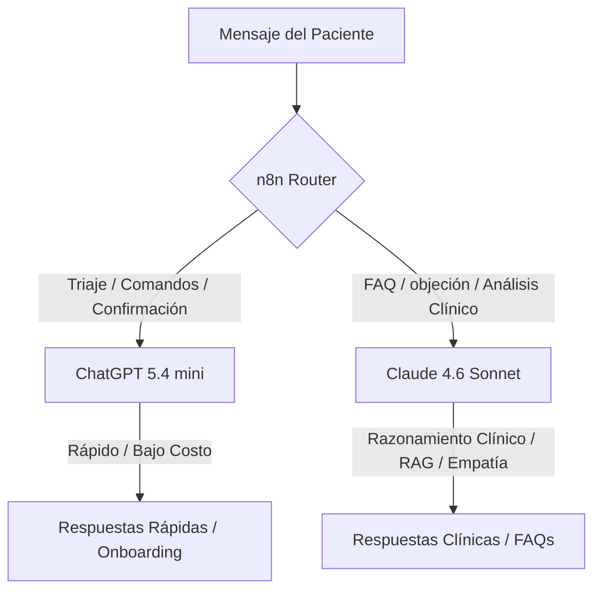
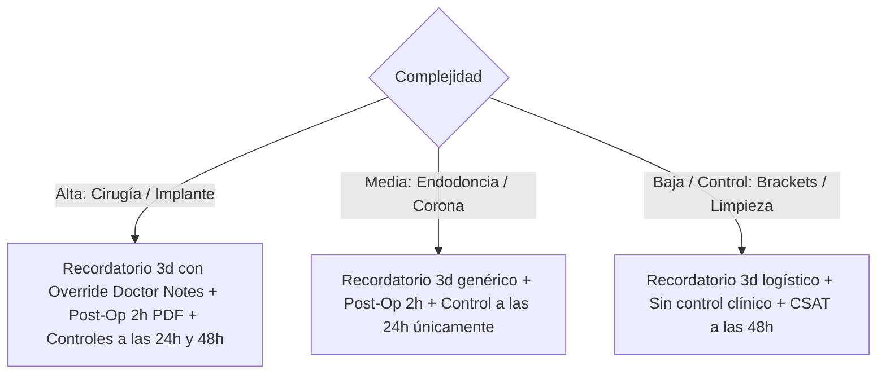

# Estudio Exhaustivo de Mejoras, Coherencia y Selección de Modelos (SaaS Audit Report)

Este documento detalla el análisis arquitectónico, la comparativa técnica de modelos de lenguaje, y la auditoría de puntos débiles y mejoras potenciales para cada uno de los 8 módulos del ecosistema **DentalA**. Consolida el análisis de coherencia de negocio, viabilidad técnica de escala, y optimizaciones dirigidas a la **Experiencia del Paciente (PX)**, **Experiencia del Doctor (DX)**, **Seguridad (SEC)** y **Onboarding/Despliegue (OB)**.

---

## 1. Estrategia de Modelos de Lenguaje: Claude 4.6 Sonnet vs. ChatGPT 5.4 mini

La combinación de **Claude 4.6 Sonnet** y **ChatGPT 5.4 mini** ofrece un balance ideal entre velocidad de respuesta (latencia), costo financiero y precisión lógica/clínica. A continuación se analiza qué modelo ejecuta cada tarea y por qué.

### 1.1. Comparativa Técnica y de Capacidades

| Dimensión | ChatGPT 5.4 mini | Claude 4.6 Sonnet | Recomendación del Agente |
|---|---|---|---|
| **Latencia** | Extremadamente baja (~300-400ms) | Moderada (~1.2 - 1.5s) | Usar **mini** para interacción fluida de chat e intenciones; **Sonnet** para razonamiento. |
| **Costo (Tokens)** | Muy bajo (~$0.15 por millón) | Medio-Alto (~$3.00 por millón) | Usar **mini** en triage y comandos diarios. Usar **Sonnet** con Prompt Caching en RAG. |
| **Razonamiento Lógico** | Básico-Intermedio | Superior / Estado de la Arte | **Sonnet** para interpretar indicaciones médicas y objeciones de agenda complejas. |
| **Adherencia al Contexto (RAG)** | Media (Propenso a pequeñas alucinaciones) | Alta (Estricto seguimiento de restricciones) | **Sonnet** de forma obligatoria para evitar dar indicaciones médicas erróneas. |
| **Estructuración JSON** | Alta (Esquemas estructurados rápidos) | Excelente (Validación estricta de variables) | Ambos son aptos. **mini** es preferido por costo/velocidad en parsing simple. |

---

### 1.2. Matriz de Distribución de Tareas

#### Tarea 1: Triaje y Clasificación de Intenciones
*   **Modelo asignado**: **ChatGPT 5.4 mini**
*   **Justificación**: Decidir si un mensaje es de tipo `"agendar"`, `"cancelar"`, o `"pregunta"` requiere baja capacidad de razonamiento pero máxima velocidad. ChatGPT 5.4 mini procesa la clasificación de intenciones en menos de 400ms a un costo mínimo.

#### Tarea 2: Consulta del Calendario y Formateo de Turnos Libres
*   **Modelo asignado**: **ChatGPT 5.4 mini**
*   **Justificación**: Tras consultar los horarios en la API de Easy!Appointments, el bot recibe un array JSON de horas disponibles. Formatear y presentar estas horas de manera conversacional (ej. *"Tengo disponible el lunes a las 10:00, 11:30 o 15:00..."*) es una tarea de formateo de texto simple que no amerita el costo de un modelo avanzado.

#### Tarea 3: Respuestas a FAQs y RAG Clínico
*   **Modelo asignado**: **Claude 4.6 Sonnet** (Con Prompt Caching activo)
*   **Justificación**: Si un paciente pregunta *"¿Puedo tomar ibuprofeno después de la extracción?"*, una alucinación del modelo es un riesgo de salud grave. Claude 4.6 Sonnet es el modelo más seguro y preciso del mercado para adherirse estrictamente al contexto inyectado de la ficha del paciente (`patients.clinical_notes`) y la base de conocimientos RAG.

#### Tarea 4: Dictado de Voz del Doctor e Interpretación Clínico-Administrativa
*   **Modelo asignado**: **ChatGPT 5.4 mini** (con fallback a **Claude 4.6 Sonnet**)
*   **Justificación**: El audio se transcribe primero a texto. ChatGPT 5.4 mini extrae los parámetros clave (`paciente`, `tratamiento_hoy`, `proximo_tratamiento`, `gap_dias`). Si el texto es confuso o hay pacientes homónimos (ej. dos "Juan Pérez"), **Claude 4.6 Sonnet** asume la desambiguación estructurando opciones inteligentes para que el doctor elija.

#### Tarea 5: Negociación de Turnos y Manejo de Objeciones
*   **Modelo asignado**: **Claude 4.6 Sonnet**
*   **Justificación**: Si un paciente reprograma o cancela diciendo *"Es que me queda muy lejos y el tratamiento es costoso"*, se requiere un modelo con alta empatía y persuasión conversacional para resolver la objeción, ofrecer alternativas de pago o financiamiento, y retener al lead.

---

## 2. Auditoría Exhaustiva y Propuestas de Mejora por Módulo (8 al 1)

A continuación, se detalla el análisis de coherencia, factibilidad y optimización segmentada para asegurar que el sistema escale sin fricciones y ofrezca la máxima calidad.

---

### Módulo 8: Ejecución Práctica, Herramientas y Optimización
*   **Coherencia**: Centraliza los mecanismos de optimización global (caché LIFO de Wishlist en Redis, de-bounce de webhooks y el buffer de escritura en diferido de Supabase). Es coherente con la base de datos (Módulo 1) y con la resiliencia (Módulo 7).
*   **Factibilidad**: **Muy alta**. La caché en Redis es factible (ya probada a nivel de conexión) y LiteLLM está completamente configurado y activo.
*   **Mejoras por Categoría**:
    *   **DX (Doctor Experience)**: Crear un script de inicialización automática de perfiles para nuevos doctores (`bootstrap_dentist.js`) en lugar de depender de registros manuales en la DB de Supabase.
    *   **PX (Patient Experience)**: Implementar decaimiento de prioridad (Priority Decay) en la Wishlist para evitar que pacientes con registros más antiguos queden en "inanición" (starvation) permanente debido a la política LIFO.
    *   **SEC (Security)**: Asegurar el aislamiento en el pool de conexiones del pooler de Supabase (Supavisor) restringiendo accesos paralelos por doctor si n8n ejecuta tareas de forma asíncrona.

---

### Módulo 7: Monitoreo, ROI y Fail-Safes de Infraestructura
*   **Coherencia**: Define el monitoreo sintético y la resiliencia en contingencias (fallback a Telegram, modo offline). Es coherente con las notificaciones de emergencia clínicas de los Módulos 3 y 6.
*   **Factibilidad**: **Alta**. Los comandos e inyecciones de prueba son realizables mediante flujos específicos en n8n.
*   **Mejoras por Categoría**:
    *   **DX**: Implementar un comando `/roi` rápido en WhatsApp que retorne estadísticas financieras instantáneas al doctor en lugar de esperar la compilación de las 20:00 h.
    *   **PX**: En la ingesta sintética de prueba, forzar en n8n la auto-resolución o el archivado de la conversación de prueba en Chatwoot para evitar que la bandeja de la secretaria se llene de chats basura (`test_synthetic_dentist`).
    *   **SEC**: Validar que el canal de fallback de Telegram del dentista use un bot seguro con tokens cargados en el `.env` privado y solo responda al chat ID correspondiente registrado del doctor.

---

### Módulo 6: Automatizaciones Outbound y Ciclo de Vida del Paciente
*   **Coherencia**: Orquesta la secuencia "3-3-4" de confirmación y seguimiento posquirúrgico por complejidad. Es coherente con el RAG y triaje clínico del Módulo 4 y Módulo 3.
*   **Factibilidad**: **Alta**. Se requiere el uso de plantillas Meta de WhatsApp debido al límite de la ventana conversacional de 24 horas.
*   **Mejoras por Categoría**:
    *   **PX (Crítica)**: Al recibir imágenes del postoperatorio quirúrgico (ej. inflamación/sangrado) y ser evaluadas por el modelo de visión, enviar un mensaje de confirmación y calma inmediato al paciente: *"He recibido tu foto y la he enviado al Dr. Pérez. Si tienes sangrado abundante presiona una gasa limpia por 20 min..."* (Pautas de Primeros Auxilios Postoperatorios).
    *   **DX**: Añadir botones interactivos de WhatsApp en las notificaciones enviadas al celular del doctor para que pueda pausar/despausar al bot o marcar la urgencia como resuelta en un clic.
    *   **SEC**: Guardar fotos clínicas enviadas por pacientes en un bucket privado de Supabase Storage con políticas RLS para evitar que enlaces de fotos de pacientes sean accesibles públicamente por terceros.

---

### Módulo 5: Wishlist 2.0 - Lista de Espera Inteligente
*   **Coherencia**: Maneja los baches y locks concurrentes en Redis. Coincide con las cancelaciones del Módulo 6 y agendamientos del Módulo 4.
*   **Factibilidad**: **Media-Alta**. La sincronización con Google Calendar es factible vía webhooks (`watch`). Sin embargo, el script Playwright RPA para Dentalink es técnicamente inviable para escalar en un SaaS debido al mantenimiento de selectores CSS. Se ratifica la recomendación de integrarlo solo en piloto de pruebas y migrar al motor nativo o a la API oficial de Dentalink.
*   **Mejoras por Categoría**:
    *   **PX**: Establecer una penalización de spam/bloqueo de wishlist: si a un paciente se le ofrecen 3 baches consecutivos y los ignora o rechaza, cambiar su estado en la wishlist a `exited_inactive` para no saturarlo ni bloquear baches a otros.
    *   **DX**: Si el doctor crea un bloqueo en su Google Calendar pero ya existía un paciente programado en ese horario, n8n debe enviarle una alerta interactiva inmediata: *"Dr., ha bloqueado un horario que ya tenía asignado a Juan Pérez. ¿Desea reprogramar automáticamente a Juan?"*
    *   **SEC**: Utilizar scripts Lua en Redis para la liberación y adquisición de locks de concurrencia, asegurando que un proceso A no elimine accidentalmente el lock recién adquirido por el proceso B.

---

### Módulo 4: Motor Inbound - FAQs y Agendamiento Cuatrimodal
*   **Coherencia**: FAQs clínicas con RAG (Claude Sonnet), agenda dual (Easy!Appointments vs. Native) y pausa dinámica del bot. Coherente con el RLS del Módulo 1 y los comandos del Módulo 3.
*   **Factibilidad**: **Alta**. LiteLLM y Supabase están listos. Luxon maneja adecuadamente las zonas horarias locales.
*   **Mejoras por Categoría**:
    *   **PX**: En la Vía 2 de agendamiento (conversacional), si el paciente rechaza los 3 horarios propuestos, habilitar un flujo de refinamiento ("¿Prefieres otro día de la semana o por la tarde?") en lugar de repetir la misma consulta de slots.
    *   **DX**: En el override clínico (Vía 3: doctor propone turno desde Chatwoot), si el horario propuesto por el doctor ya está ocupado en la agenda, el bot debe advertirle al doctor en Chatwoot: *"El jueves a las 10:00 está ocupado. ¿Desea forzar un sobreturno?"*
    *   **OB (Onboarding)**: Crear un script de vectorización automatizada (`vectorize_faqs.js`) que tome un archivo JSON de preguntas comunes del doctor y genere sus embeddings en Supabase `public.faq_embeddings`.

---

### Módulo 3: Motor Inbound - Triaje, Multimedia y Comandos
*   **Coherencia**: Webhooks de entrada, Call Rescue, de-bounce de mensajes, Whisper y comandos de voz/texto del doctor. Coherente con la seguridad de audios y privacidad del Módulo 2.
*   **Factibilidad**: **Alta**. Redis maneja el de-bounce de 3 segundos, y Whisper (vía LiteLLM) transcribe las notas.
*   **Mejoras por Categoría**:
    *   **PX**: Call Rescue robusto: detectar no solo llamadas fallidas, sino también videollamadas o mensajes multimedia no soportados (ej. contactos `.vcf`), respondiendo de forma clara sobre los canales válidos.
    *   **DX**: En el dictado clínico de voz, estructurar el prompt del parser para diferenciar si el doctor quiere añadir texto a la ficha existente (*"Añade a Juan Pérez que le hice..."*) o sobrescribirla por completo.
    *   **SEC**: Restringir estrictamente la ejecución de comandos del doctor (`/silencio`, `/resumen`) validando que el número remitente en Chatwoot sea exactamente el registrado en la columna segura de la DB y requiriendo confirmación de seguridad si se ejecuta desde un canal nuevo.

---

### Módulo 2: Conectividad, Gateway de IA y Relacionamiento
*   **Coherencia**: VPS, Zero Trust, clientes API de Node.js, psicología conversacional, encriptación AES-256-GCM y prohibición de TTS. Coherente con los modelos del Módulo 8.
*   **Factibilidad**: **Alta**. Ya están desarrollados los wrappers Node.js y validada la encriptación de datos de salud en base de datos.
*   **Mejoras por Categoría**:
    *   **PX**: Configurar una variable `personality_tone` (`formal | calido | infantil | estetico`) en la tabla `dentists` para que altere dinámicamente el prompt del sistema de Claude Sonnet en las FAQs.
    *   **SEC**: Derivar la clave de encriptación simétrica AES-256 de forma dinámica por doctor (usando el `dentist_id` como sal y una clave maestra del `.env`) en lugar de usar una clave global, aislando criptográficamente la historia clínica de cada consultorio.
    *   **OB**: Proveer un script para el aprovisionamiento automatizado del canal Chatwoot BYON (configurando webhooks y tokens de Meta mediante peticiones directas de API).

---

### Módulo 1: Base de Datos y Hardening Estructural
*   **Coherencia**: ERD relacional, RLS no-correlacionado, rol de aplicación `n8n_app_user` con BYPASSRLS, triggers de auditoría inmutables en esquema `audit`.
*   **Factibilidad**: **Excelente**. Estructura robusta y completamente verificada por el script `verify_hardening.js`.
*   **Mejoras por Categoría**:
    *   **DX**: Integrar la tabla `patient_clinical_history` sugerida por la auditoría de diseño para registrar el histórico de notas por cita y no sobrescribir la columna global.
    *   **SEC**: Habilitar conexiones SSL/TLS forzadas para el rol `n8n_app_user` en Supabase y auditar la función del trigger para que ignore actualizaciones en campos técnicos de control de tokens (`daily_token_usage`) a fin de evitar el llenado del log con basura.
    *   **OB**: Definir un proceso de migraciones con base de datos versionada en git (`/security_hardening_resources/migrations/`) para el control de versiones del esquema en producción.

---

## 3. Decisiones Arquitectónicas Específicas

### 3.1. Selección del Motor de Audio: Whisper vs. LLM con Audio Nativo

Para el procesamiento de los mensajes de voz entrantes (tanto de pacientes como del doctor), el sistema utiliza un flujo basado en **OpenAI Whisper (o contenedor Whisper local en Coolify) + procesamiento de texto con LLM**, en lugar de utilizar capacidades nativas de voz de modelos multimodales complejos:
*   **Razonabilidad de Whisper**:
    1.  **Control de Ficha y Depuración**: Al transcribir primero a texto, el historial textual queda guardado de manera limpia en la interfaz de Chatwoot, facilitando que el doctor o secretaria lean a simple vista el mensaje sin necesidad de escuchar el audio física o digitalmente.
    2.  **Detección de Variables**: ChatGPT 5.4 mini puede procesar el texto transcrito de forma muy robusta y a costo ínfimo para extraer parámetros JSON en comparación con la tarifa por minuto de APIs de audio nativas directas.
    3.  **Terminología Dental**: Whisper permite inyectar un parámetro `initial_prompt` con términos odontológicos comunes, garantizando alta precisión en dictados técnicos del dentista.

### 3.2. Lógica Temporal y Seguimientos Clínicos Adaptativos por Tratamiento

En lugar de un recordatorio y seguimiento uniforme, el sistema varía sus tiempos y cantidad de mensajes en base a la criticidad y complejidad del procedimiento (`treatment_complexity`):

*   **Lógica ante Tratamiento Siguiente "Desconocido"**:
    Si el gap del último control está por vencer (3 semanas antes de `estimated_due_date`) y no se conoce el procedimiento a realizar:
    1.  n8n envía un WhatsApp interactivo preguntando qué desea agendar o si tiene alguna molestia.
    2.  El bot clasifica la respuesta y actualiza la metadata de la cita antes de despachar las indicaciones pre-cita correctas, evitando enviar instrucciones preoperatorias de cirugía a un control logístico de brackets.
*   **Prioridad de Dictado Médico**:
    Cualquier audio dictado por el doctor con indicaciones preoperatorias específicas para un paciente anula automáticamente las instrucciones genéricas de la base de datos RAG, priorizando las notas personalizadas.

### 3.3. Ciclo de Pausa y Reactivación Automática del Bot (Pausa Dinámica)

El sistema gestiona cuándo el bot responde de forma autónoma y cuándo se apaga para dar paso a la gestión humana a través de `session_status` de la tabla `patients`:

*   **Desactivación Automática (Pausa del Bot a `bot_paused` / `doctor_active`)**:
    *   **Intervención Humana (Bypass)**: Cuando la secretaria o el doctor responden manualmente desde Chatwoot, n8n intercepta el evento de webhook `message_created` (de tipo `user`) y cambia el estado a `doctor_active` para evitar interrupciones de la IA.
    *   **Urgencias Clínicas**: Si en los mensajes de seguimiento post-quirúrgico el paciente reporta dolor o sangrado, el bot cambia el estado a `bot_paused` para congelar respuestas automáticas.
    *   **Fallas del RAG**: Si Claude Sonnet carece de datos para responder a una pregunta médica o de precios, se auto-pausa de inmediato.
*   **Reactivación Automática (`bot_active`)**:
    *   **Resolución de Ticket**: Al marcar la conversación como "Resuelta" en Chatwoot, el bot se vuelve a encender automáticamente.
    *   **Grace Timer (Redis)**: Se define una llave en Redis con TTL de 24 horas (`paused:session:{patient_id}`). Si transcurre ese tiempo y el humano no interactuó o no cerró el caso, el bot se auto-habilita para no dejar al paciente sin respuesta.
*   **Envío de Alertas Críticas al Dentista**:
    *   Ante cualquier pausa crítica (Dolor severo, fallo de RAG, frustración), n8n envía una **plantilla interactiva de WhatsApp bypass al celular privado del doctor** (incluso si tiene activado el modo silencio `/silencio`).
    *   Si la API de WhatsApp falla o no reporta entrega en 60 segundos, n8n dispara la notificación mediante un bot de **Telegram de respaldo** conectado al Chat ID del doctor.
