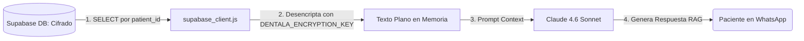
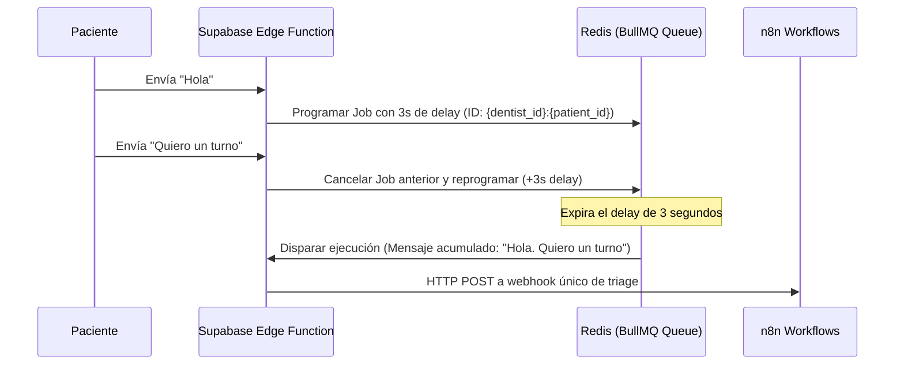

# 📡 DentalA - Reporte de Auditoría y Diseño de Arquitectura (Coherencia y Factibilidad)

Este documento detalla el análisis exhaustivo de coherencia, viabilidad técnica, seguridad, escalabilidad y experiencia de usuario (UX) para los 8 módulos del ecosistema DentalA. Proporciona soluciones técnicas definitivas y listas para implementar para resolver las brechas identificadas.

---

## 📋 Resumen del Análisis de Impacto y Viabilidad

| Módulo | Componente Clave | Nivel de Riesgo | Estado de Factibilidad | Acción Requerida |
|---|---|---|---|---|
| **Módulo 1** | Aislamiento RLS en Base de Datos | **Crítico** | ⚠️ Incoherente | Corregir la consulta de staff para permitir acceso directo al Dentista. |
| **Módulo 2** | Encriptación GCM + RAG de Historia Clínica | **Medio** | ✅ Factible | Desencriptar en capa de Node.js antes de enviar contexto al LLM. |
| **Módulo 3** | Ingesta de Mensajes y Debounce | **Alto** | ⚠️ Ineficiente en n8n | Diseñar Gateway intermedio de Node.js/Edge Function con BullMQ. |
| **Módulo 4** | Dual-Engine Scheduler (Easy!Appointments) | **Medio** | ✅ Factible | Implementar hooks de salida PHP en Easy!Appointments. Evitar bucles en GCal. |
| **Módulo 5** | Sincronización RPA (Dentalink) | **Crítico** | ❌ No Factible a Escala | Definir RPA solo como piloto. Planificar migración a API oficial de Dentalink. |
| **Módulo 6** | Ciclo de Vida Outbound y Reputación Meta | **Bajo** | ✅ Factible | Control de calidad Meta y lógica de Opt-In. |
| **Módulo 7** | Monitoreo Sintético y ROI | **Bajo** | ✅ Factible | Filtro estricto de `test_synthetic_dentist` en cálculos estadísticos. |
| **Módulo 8** | Sincronización Diferida Redis-Supabase | **Medio** | ✅ Factible | Configurar Redis AOF / TTL Expiration Trigger para salvaguardar datos. |

---

## 🔒 Sección 1: Seguridad, Hardening y Aislamiento de Datos

### 1.1. Corrección Definitiva del Row Level Security (RLS)
El diseño original de la política RLS en el Módulo 8 (Sección 3.1) bloquea el acceso de los odontólogos principales a sus propios registros de pacientes, ya que no están registrados en la tabla `dentist_staff`.

**Solución**: Se actualiza el esquema relacional con una política compuesta que valida tanto al propietario de los datos (`dentist_id`) como al personal auxiliar autorizado (`dentist_staff`).

```sql
-- Habilitar RLS en la tabla de pacientes
ALTER TABLE public.patients ENABLE ROW LEVEL SECURITY;

-- Crear política compuesta eficiente y no-correlacionada
CREATE POLICY dentist_and_staff_access_policy ON public.patients
    FOR ALL
    TO authenticated
    USING (
        dentist_id = auth.uid() OR 
        dentist_id = (SELECT dentist_id FROM public.dentist_staff WHERE user_id = auth.uid())
    );
```
*Este patrón debe replicarse con la misma lógica en `appointments`, `wishlist`, `sub_profiles`, `kpis_analytics` y `faq_embeddings`.*

### 1.2. Pipeline de Descifrado de Historia Clínica para RAG
Los campos `clinical_notes` (historia clínica) y `psychological_profile` se encriptan simétricamente (AES-256-GCM) en la base de datos para cumplir con HIPAA/GDPR. Para realizar búsquedas sobre estos datos sin romper la seguridad:


*   **Restricción de Búsqueda**: La búsqueda semántica global está deshabilitada en notas clínicas. Dado que el contexto RAG de indicaciones quirúrgicas es estrictamente individual, el descifrado se realiza en la capa del cliente de Node.js para el paciente activo antes de enviarse al LLM.

---

## 🔄 Sección 2: Integraciones y Evitación de Bucles (Loops)

### 2.1. Mitigación del Bucle Infinito de Sincronización de Calendarios
Cuando n8n escribe una cita en Google Calendar (GCal), este genera un evento de webhook de cambio. Si n8n vuelve a procesar este evento e intenta agendarlo de regreso en Easy!Appointments, se produce un bucle circular infinito.

**Solución**: Marcado de metadatos en GCal (`extendedProperties`).
1. Al crear el evento en Google Calendar desde n8n, se adjunta una propiedad extendida privada:
   ```json
   {
     "extendedProperties": {
       "private": {
         "source": "dentala",
         "appointment_id": "12345"
       }
     }
   }
   ```
2. Cuando el webhook de Google Calendar notifica una actualización a n8n, el flujo verifica la propiedad `extendedProperties.private.source`. Si es igual a `"dentala"`, **n8n ignora el mensaje de inmediato y aborta el flujo**, deteniendo el bucle.

### 2.2. Webhooks Activos de Easy!Appointments (Modo A)
Para sincronizar las reservas manuales que realiza la secretaria en el portal de Easy!Appointments hacia Supabase en tiempo real, se requiere configurar un webhook saliente en el framework CodeIgniter de la aplicación PHP.

**Implementación**:
En el controlador de citas de Easy!Appointments (`application/controllers/Appointments.php`), en los métodos de guardar y cancelar, se inyecta una llamada de red hacia n8n:
```php
// En el método book() de Easy!Appointments despues del guardado en DB MySQL:
$n8n_url = "https://n8n.dental-a.com/webhook/appointments";
$payload = json_encode([
    'event' => 'appointment_created',
    'appointment_id' => $appointment_id,
    'dentist_id' => $dentist_id
]);
$ch = curl_init($n8n_url);
curl_setopt($ch, CURLOPT_RETURNTRANSFER, true);
curl_setopt($ch, CURLOPT_HTTPHEADER, ['Content-Type: application/json']);
curl_setopt($ch, CURLOPT_POST, true);
curl_setopt($ch, CURLOPT_POSTFIELDS, $payload);
curl_exec($ch);
curl_close($ch);
```

### 2.3. Transición Dentalink RPA a API
*   **MVP / Piloto**: El script de Playwright se ejecuta de forma asíncrona una vez por noche en una cola Redis de baja prioridad para conciliar la agenda, evitando clics en tiempo real durante la conversación del chat.
*   **Producción**: El sistema expone un interruptor en el panel de control del doctor. Si se activa, n8n realiza llamadas directas a la API de Dentalink utilizando tokens de integración del cliente, asumiendo la clínica el costo transaccional.

---

## ⚡ Sección 3: Escalabilidad y Debouncing de Ingesta

### 3.1. Arquitectura de Ingesta y Buffer Anti-Inundación (Debounce con Redis)
El procesamiento de debounce en n8n mediante nodos de espera tradicionales satura el motor del orquestador. La solución escalable despliega un **Proxy de Ingesta Ligero** que consolida la ráfaga de mensajes de WhatsApp antes de despertar a n8n.



#### Redis Keyspace Expiration Fallback
Si no se utiliza BullMQ, el gateway puede escribir una clave en Redis `lock:triage:{dentist_id}:{patient_id}` con un TTL de 3 segundos y acumular los textos en una lista `queue:triage:{dentist_id}:{patient_id}`.
Al expirar la clave, Redis genera un evento de keyspace notification `__keyevent@0__:expired` que es capturado por un worker de n8n para extraer la lista y procesarla.

### 3.2. Sincronización Diferida de Perfiles (Deferred Sync)
Para evitar escrituras constantes en Supabase por cada mensaje:
1. Las actualizaciones al perfil psicológico del paciente se guardan en la clave Redis `patient:profile:pending:{dentist_id}:{patient_id}`.
2. Se setea un bloqueo de sincronización `sync:lock:{dentist_id}:{patient_id}` con un TTL de 15 minutos.
3. Cuando transcurren 15 minutos sin nuevos mensajes del paciente, el bloqueo expira y el evento de expiración gatilla a n8n para realizar un único `UPDATE` en la tabla `public.patients` de Supabase, vaciando luego la caché de Redis.

---

## 💬 Sección 4: UX Conversacional, Onboarding y Fail-Safes

### 4.1. Rescate de Llamadas de WhatsApp (WhatsApp Call Rescue)
Meta envía un webhook de tipo `messages` con el campo `type` marcado como `"unsupported"` y el código de error `131050` cuando se detecta una llamada entrante de voz o video.

**Filtro en n8n**:
```javascript
// Validación en el nodo de entrada de n8n para webhooks de WhatsApp
const message = input.json.entry[0].changes[0].value.messages[0];
if (message.type === 'unsupported' && message.errors && message.errors[0].code === 131050) {
    // Es un intento de llamada. Derivar al flujo de envío de plantilla interactiva de rescate.
    return { is_call_rescue: true, recipient: message.from };
}
```

### 4.2. Doble Confirmación de Dictado Clínico (Módulo 3, Sección 3.1)
Para mitigar transcripciones incorrectas de medicamentos o nombres por Whisper:
1. El doctor graba su dictado posquirúrgico (ej. *"Recetarle amoxicilina 500mg cada 8 horas a Juan Pérez"*).
2. n8n transcribe el audio y busca coincidencias exactas del paciente. Si encuentra múltiples coincidencias (homónimos), envía botones interactivos al WhatsApp del doctor:
   > *"Encontré 2 pacientes con ese nombre. ¿A quién te refieres?"*
   > **[Juan Pérez (Implante)]**  **[Juan Pérez (Ortodoncia)]**
3. Tras seleccionar el paciente, n8n le envía una tarjeta de confirmación estructurada:
   > *"Confirma la nota clínica para Juan Pérez (Implante):*
   > *• Indicaciones: Amoxicilina 500mg cada 8h por 7 días.*
   > *• Próximo control: 10 días."*
   > **[Aprobar y Registrar]**  **[Corregir Nota]**
4. Solo al presionar **[Aprobar y Registrar]**, se modifica la base de datos Supabase (`patients.clinical_notes`).

### 4.3. Automatización de Onboarding de Nuevos Dentistas (SaaS Provisioning)
Para garantizar un onboarding sin fricción manual a medida que la SaaS escala comercialmente, se establece un flujo automatizado en n8n gatillado por la creación de un nuevo registro en la tabla `public.dentists`:
1. **Paso 1: Aprovisionamiento de Infraestructura**: n8n llama a la API de Coolify para instanciar dinámicamente un nuevo contenedor de Easy!Appointments (Modo A) y su respectivo esquema de base de datos MySQL en caliente.
2. **Paso 2: Registro DNS Automático**: n8n invoca a la API de Cloudflare para crear un registro CNAME (ej. `agenda-doctor.dental-a.com` apuntando al tunnel correspondiente) y habilita el SSL Full (Strict).
3. **Paso 3: Configuración de Chatwoot**: n8n llama a la API de Chatwoot para crear una bandeja de entrada (inbox) exclusiva y asociar el webhook de entrada.
4. **Paso 4: Envío de Credenciales**: n8n envía un correo/WhatsApp automatizado al doctor con sus URLs de acceso y llaves de cifrado generadas.

### 4.4. Tolerancia del Lock de Redis y Renovación Activa (Watchdog)
El lock preventivo de 30 segundos en Redis (`lock:appointment_slot:...`) puede expirar antes de que la llamada HTTP de Easy!Appointments retorne en redes lentas, arriesgando reservas duplicadas.
*   **Solución**: Se implementa un multiplicador de seguridad aumentando el TTL inicial del lock de Redis a **60 segundos** de forma predeterminada, y se programa una tarea periódica de renovación en n8n que refresca el TTL cada 15 segundos si el estado de la llamada de reserva sigue en `pending`.

### 4.5. Restricción del Margen de 24 Horas de WhatsApp y Meta Templates
Cualquier mensaje outbound iniciado proactivamente por el sistema (ej. recordatorios 3-3-4, CSAT a las 48h, recuperación de no-shows, o reactivación tras 60 días) se envía fuera de la ventana de interacción activa de 24 horas definida por Meta.
*   **Restricción Crítica de Factibilidad**: **Queda estrictamente prohibido enviar mensajes outbound en texto plano conversacional**. Todas las secuencias salientes programadas deben hacer uso exclusivo de **Plantillas de WhatsApp Interactivas aprobadas por Meta** (Meta Approved Templates).
*   **Mapeo de Variables**: n8n debe armar el payload de la API de Meta apuntando al `Template Name` y `Namespace` correspondiente e inyectando las variables requeridas (nombre del paciente, fecha del turno, link de Google Maps) en los parámetros posicionales definidos en la plantilla aprobada.


---

## 🤝 Sección 5: Copilot Conversacional del Doctor - Briefing de Empatía Pre-Cita

Para elevar la experiencia de usuario a un nivel boutique premium y capacitar al doctor con inteligencia de empatía en tiempo real segundos antes de atender al paciente, el sistema implementa el **Copilot de Empatía del Doctor**:

### 5.1. Flujo Técnico de n8n (Cron Trigger)
1. **Paso 1 (Cron)**: Cada 10 minutos, n8n ejecuta un cron que realiza una consulta SQL sobre Supabase para identificar citas confirmadas que inician exactamente en 10 minutos:
   ```sql
   SELECT 
       a.appointment_id,
       a.dentist_id,
       a.patient_id,
       p.name AS patient_name,
       p.psychological_profile,
       p.clinical_notes,
       a.appointment_date_time
   FROM public.appointments a
   JOIN public.patients p ON a.dentist_id = p.dentist_id AND a.patient_id = p.patient_id
   WHERE a.appointment_date_time = NOW() + INTERVAL '10 minutes'
     AND a.status = 'confirmed';
   ```
2. **Paso 2 (Descifrado)**: Para cada cita devuelta, el wrapper de Node.js de n8n descifra en memoria los campos `psychological_profile` (fobias, gustos, temas de conversación familiares) y `clinical_notes`.
3. **Paso 3 (Estructuración)**: ChatGPT 5.4 mini toma la información estructurada y redacta un micro-briefing ejecutivo de 3 viñetas breves (foco en lectura rápida de 5 segundos).
4. **Paso 4 (Canal de Envío)**:
   * **Canal Primario (Chatwoot Private Note)**: n8n llama a la API de Chatwoot para insertar una nota interna amarilla en el chat del paciente. Esto dispara la notificación push móvil instantánea al celular del doctor sin cargo de Meta.
   * **Canal Secundario (WhatsApp Template Fallback)**: Si el doctor lo tiene habilitado en sus preferencias, n8n envía un WhatsApp a su celular privado usando la plantilla homologada `doctor_copilot_briefing`.

### 5.2. Ejemplo del Briefing Generado
> *"📋 **COPILOT EMPATÍA - Siguiente Paciente: Juan Pérez (14:30)**
> *• **Fobia**: Nivel alto de ansiedad al torno. Iniciar con anestesia tópica.*
> *• **Cercanía**: Preguntarle por su hijo Mateo (comenzó la escuela esta semana).*
> *• **Clínico**: Hoy corresponde perno y corona en pieza 46. Provisional lista."*

---


## 🛠️ Plan de Verificación Técnica (TDD)
El Agente de desarrollo implementará el script de validación [.agents/scripts/api_clients/verify_hardening.js](file:///c:/Users/Renzo/OneDrive/Documentos/DentalA/.agents/scripts/api_clients/verify_hardening.js) que ejecutará las siguientes pruebas automáticas en el entorno de desarrollo:

1.  **Prueba de Aislamiento RLS**: Firmar un JWT simulando al `dentist_id = A` e intentar leer pacientes del `dentist_id = B`. Debe retornar 0 registros.
2.  **Prueba de Staff**: Autenticar como asistente registrado en `dentist_staff` para el Doctor A y validar que puede leer los pacientes del Doctor A pero no del Doctor B.
3.  **Prueba de Inmutabilidad del Log**: Intentar insertar un registro directamente en la tabla `audit.clinical_audit_log` con credenciales de `n8n_app_user` a través de la API REST. Debe retornar error de permisos (401/403).
4.  **Prueba de Desencadenamiento (Trigger)**: Insertar una cita de prueba en `public.appointments` y verificar que el trigger automático cree un log de auditoría en la tabla privada de auditoría.
5.  **Chequeo de Seguridad Focalizado**: Validar que los tokens expuestos, firmas de webhook y sanitización de inputs se ajusten a las políticas del [Reporte de Chequeo de Seguridad Focalizado](file:///c:/Users/Renzo/OneDrive/Documentos/DentalA/docs/superpowers/specs/2026-06-04-focused-security-review.md).
